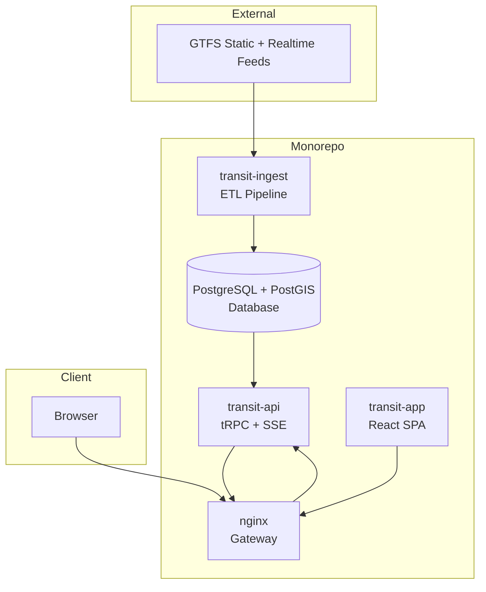

<div align="center">

<h1>Clairvoyance</h1>


Realtime transit webapp using GTFS data in a microservice architecture.


Visit the [demo site](https://transit.hy1.dev).

</div>

## Features

- **Interactive map** - Browse routes, stops, and vehicle positions across the network
- **Nearby stops** - Find transit stops around your current location
- **Departure predictions** - Know when your next ride arrives with live estimates
- **Full schedules** - Timetables for trip planning across the entire network
- **Live vehicle tracking** - See buses and trains move on the map in real time
- **Trip details** - Timeline, route map, and stop information for any trip
- **Service alerts** - Stay informed about delays, detours, and disruptions


## Architecture



## Tech Stack

- **Frontend**: TanStack Router + React 19 + TanStack Query + Tailwind CSS + shadcn/ui + Vite + TypeScript
- **Backend**: Bun + tRPC (SSE subscriptions for realtime)
- **ETL**: Bun CLI + Protobuf + TypeScript + AsyncIterable streaming pipeline
- **ORM**: Drizzle ORM
- **Database**: PostgreSQL 18 + PostGIS 3
- **Maps**: MapLibre GL + Protomaps tiles
- **Containerization**: Docker
- **Reverse Proxy**: nginx
- **Monorepo**: Bun workspaces

## Roadmap

- **PWA**: Manifest + icons done, service worker pending
- **Offline Support**: Not started
- **Additional agency support**: Extend ingestion for more transit agencies
- **Performance**: Continued query optimization and UI responsiveness

## Quick Start

```bash
docker compose up -d --build
```

